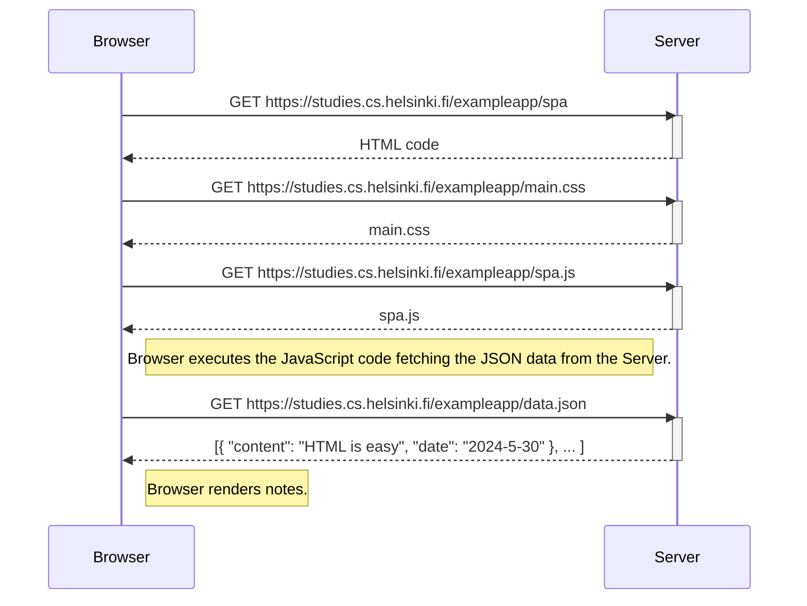

Single page app diagram

```mermaid

sequenceDiagram
   
    Browser->>Server: GET  https://studies.cs.helsinki.fi/exampleapp/spa
    activate Server
    Server-->>Browser: HTML code
    deactivate Server

    Browser->>Server: GET https://studies.cs.helsinki.fi/exampleapp/main.css
    activate Server
    Server-->>Browser: main.css
    deactivate Server

    Browser->>Server: GET https://studies.cs.helsinki.fi/exampleapp/spa.js
    activate Server
    Server-->>Browser: spa.js
    deactivate Server

    Note right of Browser: Browser executes the JavaScript code fetching the JSON data from the Server.

    Browser->>Server: GET https://studies.cs.helsinki.fi/exampleapp/data.json
    activate Server
    Server-->>Browser: [{ "content": "HTML is easy", "date": "2024-5-30" }, ... ]
    deactivate Server

    Note right of Browser: Browser renders notes.
```